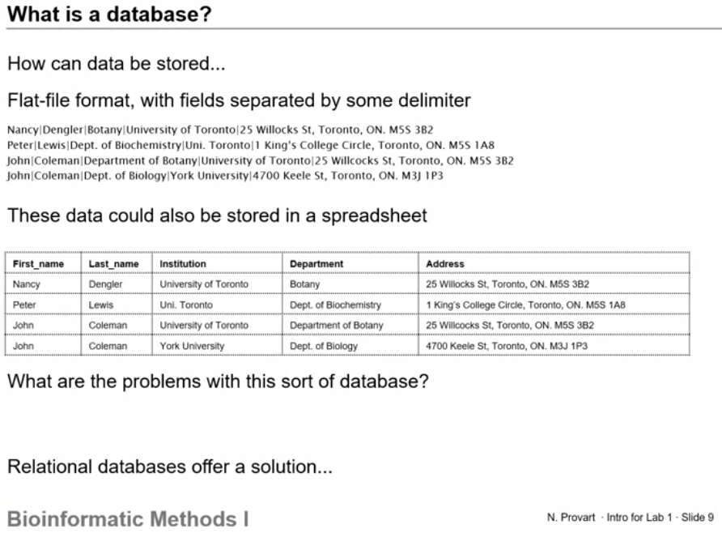
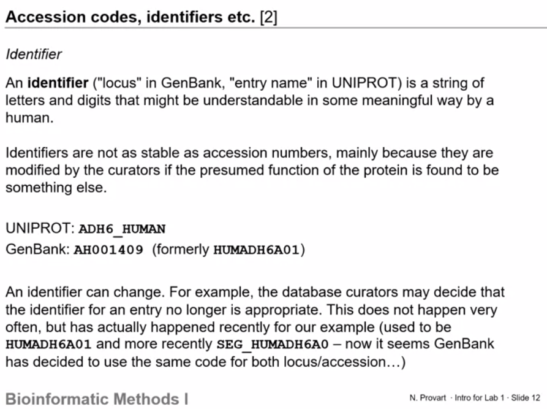

# **Plant Bioinformatics Method-I** 
[Here is the link of this course](https://www.coursera.org/learn/bioinformatics-methods-1/lecture/gnPjk/lecture)

I started learning this course on 02.03.2022 after the presentation of progress report in IFAM, Uni Kiel, Germany.

> ## **What is bioinformatics?**
Bioinformatics:
- is the development of application of computational tools in manging all kinds of biological data
- involves the technology that uses computers for storage, retrieval, manipulation, and distribution of information related to biological macromolecules such as DNA, RNA, proteins, and metabolites
- generally limted to sequence, structural, and functional analysis of genes and genomes, and their corresponding products
- sometimes called computational molecular biology
---
This field has really developed in the past 15 years due to the efforts of genome sequencing projects, such as the [human genome sequencing project](https://www.genome.gov/human-genome-project).

> ## **Why do we need bioinformatics?**

- How do we deal with three billion pieces of sequence information? 
- So why do we need bioinformatics? 
- Well, if you can imagine three billion letters in the human genome, three billion nucleotides, how do you really make sense of that without using computers? 

> ## Biological databases
> The other thing that bioinformatics is about is biological databases, how we can store these biological data
1. **Why databases are used?**

To archive accumulated knowledge and to provide scientists with easy access to biological data.

2. **What is a database? What are the Data structures: Flat file databses vs Rational databases?**

How can we store the files in databases? 
- **Flat File Format:**

One type is Flat File format with fields separated by some delimiters. Here is an example.

 

There is a problem with flat file format database, as there are some retundencies in the file. Same information is repeated many times.

- **Relational Databases**

Relational databases consists of relations (tables) containing attributes (columns or fileds).\
Each row in a table is known as tupple or records similar to pythons. 
> _If you are interested in learning Data Science with Python ( a 40 days course) in urdu/Hindi language you can browse follwoing playlist ([Python ka Chilla with Baba Aammar](https://www.youtube.com/watch?v=QvPekMN4F0w&list=PL9XvIvvVL50HVsu-Ao8NBr0UJSO8O6lBI)_)

Here is another detailed example from Plant Bioinformatics Course on Coursera

Foriegn key is used to link tables with similar information of one or more columns. Which is actually the primary key of a column of contacts in the second table.

SQL (Structured Querry Language) is an example of querry database and we will cover this in a separate crash course in urdu/hindi language, link is coming soon.

> **Accession numbers and identifiers (genebank flat file format)**\
> Many of the biological databases (Genebank, UNIPROT etc.) have several ways to identify a specific given entry:
> - Identifier
> - Accession code (or a specific number)

Here is the detailed version of that:

 

1. **A pratical example of utility - NCBI Search (GQuery/Entrez)**.