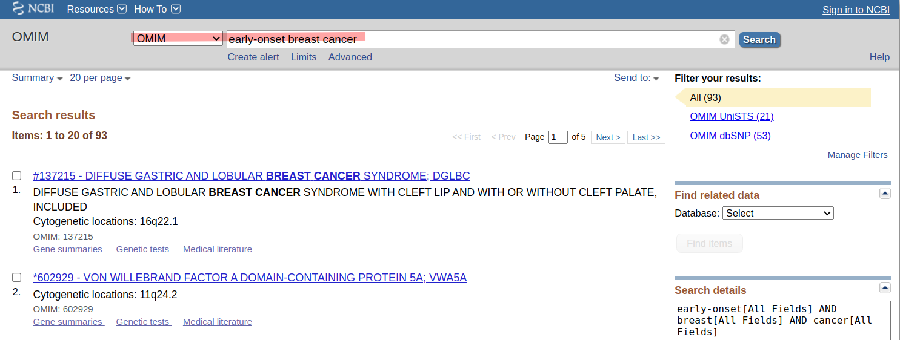
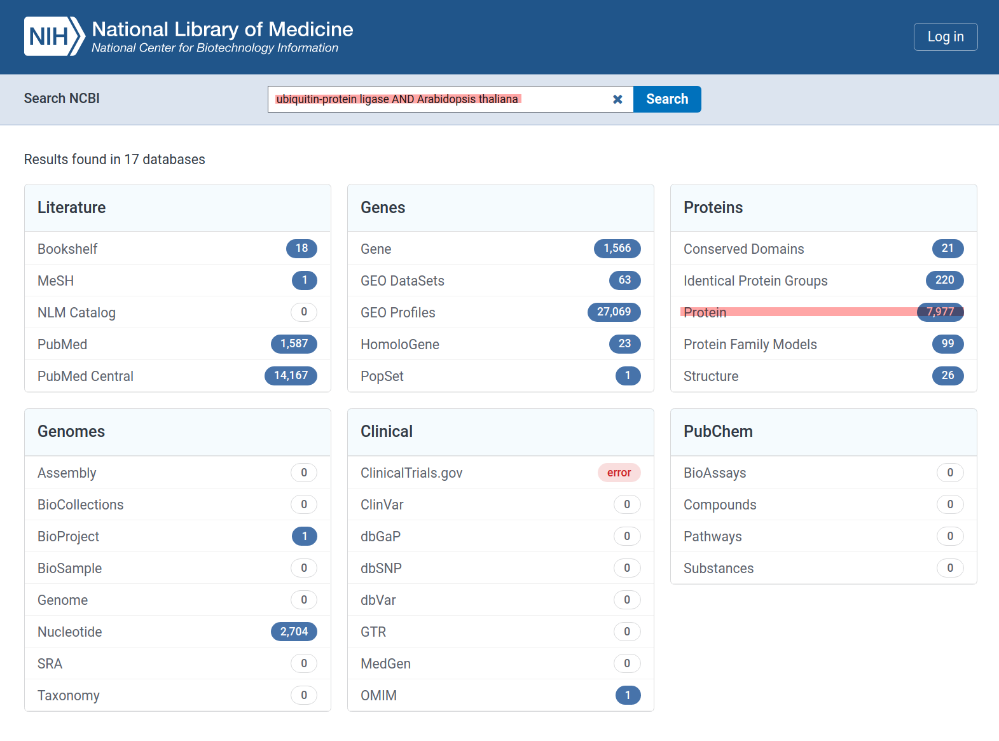

# **Plant Bioinformatics Method-I** 
[Here is the link of this course](https://www.coursera.org/learn/bioinformatics-methods-1/lecture/gnPjk/lecture)

I started learning this course on 02.03.2022 after the presentation of progress report in IFAM, Uni Kiel, Germany.

> ## **What is bioinformatics?**
Bioinformatics:
- is the development of application of computational tools in manging all kinds of biological data
- involves the technology that uses computers for storage, retrieval, manipulation, and distribution of information related to biological macromolecules such as DNA, RNA, proteins, and metabolites
- generally limted to sequence, structural, and functional analysis of genes and genomes, and their corresponding products
- sometimes called computational molecular biology
---
This field has really developed in the past 15 years due to the efforts of genome sequencing projects, such as the [human genome sequencing project](https://www.genome.gov/human-genome-project).

> ## **Why do we need bioinformatics?**

- How do we deal with three billion pieces of sequence information? 
- So why do we need bioinformatics? 
- Well, if you can imagine three billion letters in the human genome, three billion nucleotides, how do you really make sense of that without using computers? 

> ## Biological databases
> The other thing that bioinformatics is about is biological databases, how we can store these biological data
1. **Why databases are used?**

To archive accumulated knowledge and to provide scientists with easy access to biological data.

2. **What is a database? What are the Data structures: Flat file databses vs Rational databases?**

How can we store the files in databases? 
- **Flat File Format:**

One type is Flat File format with fields separated by some delimiters. Here is an example.

 

There is a problem with flat file format database, as there are some retundencies in the file. Same information is repeated many times.

- **Relational Databases**

Relational databases consists of relations (tables) containing attributes (columns or fileds).\
Each row in a table is known as tupple or records similar to pythons. 
> _If you are interested in learning Data Science with Python ( a 40 days course) in urdu/Hindi language you can browse follwoing playlist ([Python ka Chilla with Baba Aammar](https://www.youtube.com/watch?v=QvPekMN4F0w&list=PL9XvIvvVL50HVsu-Ao8NBr0UJSO8O6lBI)_)

Here is another detailed example from Plant Bioinformatics Course on Coursera

Foriegn key is used to link tables with similar information of one or more columns. Which is actually the primary key of a column of contacts in the second table.

SQL (Structured Querry Language) is an example of querry database and we will cover this in a separate crash course in urdu/hindi language, link is coming soon.

> **Accession numbers and identifiers (genebank flat file format)**\
> Many of the biological databases (Genebank, UNIPROT etc.) have several ways to identify a specific given entry:
> - Identifier
> - Accession code (or a specific number)

Here is the detailed version of that:

Another popular type is the accession number or accession code:
> **Accession number or accession code:**\
> An accession code (or number) is a number (with a few characters in front) that uniquely identifies an entry.\
> It is often assigned arbitrarily. For example, the
accession code for ADH6_HUMAN in UNIPROT is P28332.In the case of GenBank, the accession code for the human ADH6 gene
sequence is AH001409.

**Versioning of sequences GenBank**:\
Records typically contain the Accession.Version identifier, such as **AHO01409.2**, in the VERSION Iine of the record. This identifier used to be mapped to its corresponding GI* number, which was like the "primary key" of GenBank.

>- To specify a sequence exactly in GenBank, use its _**Accession.Version**_.
> - To retrieve the most up-to-date sequence, use the accession number without
version: the most up-to-date sequence will be retrieved automatically. 

The GI (Genlnfo ldentifier) system was deprecated as of 2016 use Accession.Version only to
retrieve a specific sequence - but you will still see Gls in GenBank records!

> **A pratical example of utility - NCBI Search (GQuery/Entrez)**\
> Human alcohol dehydrogenase VI gene to find with the following [link](https://www.ncbi.nlm.nih.gov/nuccore/AH001409)

**After going to the link following information will appear:**

> _**Note: in some records we may see a CDS (Coding sequence) feature followed by the sequence itself as following:**_

---
**From 1982 to February 2020, GenBank statistics can be found on the [this link](https://www.ncbi.nlm.nih.gov/genbank/statistics/)**

Currently it is showing something like this:

### **How to Search Sequences:**

Searching GenBank or other sequencing databases (DBs) can be done using:
1. keywords
2. using sequence similarity using [NCBI BLAST](https://blast.ncbi.nlm.nih.gov/Blast.cgi)

**Google and other search engines can not search sequence similarities better than blasting, because tehse search engines can not run partial matches to similar sequence with gaps and they also don't which amino acids have similar properties.**

Here's you can use [blast in NCBI](https://blast.ncbi.nlm.nih.gov/Blast.cgi?PROGRAM=blastn&PAGE_TYPE=BlastSearch&LINK_LOC=blasthome)

<!-- 
#this is how you can add colors to text but it will not work in .md files on github doc

Your text here

 -->

**Important Terms and Definitions:**

Please google these and clear your concepts
1. Homologs
2. Paralogs
3. Orthologs
4. Speciation
5. Gene duplication
6. SNPs

### **Searching across DBs: the NCBI Search tool**

[NCBI Seach tool](https://www.ncbi.nlm.nih.gov/search/) (previously known as ENtrez/GQuery) is one of the best tools to search DBs. NCBI Search provides links between many of the DBs at NCBI. 

**Example:**

Identify the SNPs which potentially cause early onset breast cancer, and design oligos to PCR them in samples of human genomic DNA for sequencing.\
We can use OMIM (Online Mendelian Inheritance in Man) database from the list of the DBs on the left side of search bar.\
OMIM has links to everything that is known about a given disease across the various DBs at NCBI.

Click on **"Gene Summaries"**

We can find SNPs use a tool called primer3 to design a primer of that specific SNP, to find out the variation in the person genomic DNA sample.
This process will take less than 15 minutes to find a solution and methodology to a problem.\
This one set of information will help us to find the incredible set of information stored in NCBI.

In the upcoming lecture, we will be talking about blast.

We can also use [NCBI's variation viewer](https://www.ncbi.nlm.nih.gov/variation/view) to find non-synonymous SNPs information. 

---

# **Pre-requisists to search on NCBI:**

The National Center for Biotechnology Information (NCBI)maintained by the US National Library of Medicine and National Institutes of Health is one of the world’s most important resources and repositories for biological data.

Entire genomes, from viruses to humans, are compiled, organized, and cross-referenced within these networks, such that surfing the genome can be almost as easy as surfing the web.

But you must know the following before starting your search on NCBI: 
1. What you are looking _**for**_?
2. What you are looking _**at**_?

to get out of these DBs.\
**We will learn these in the following section**

Normally google and other search engines do not index database driven websites, which is why it can not be used for searching the information stored in databases such as NCBI.

Google can not handle protein searching as well as it can not handle sequence searching.

We will go step by step to explore [NCBI website](https://www.ncbi.nlm.nih.gov/) which is constantly being updated.

We can read the about NCBi and Search via _**search tool of NCBI**_ (formerly known as GQuery or Entrez) in the search bar to go to the specific topic as shown here:

When you go to the searchbar and type **_Bacteria_** it will give you a whole list of hits in each section. This search will give us millions of hits which is not specific for research purposes. We should narrow it down.
Here's what it looks like:

### **Example:**

Usually when searching these databases, you have either a region of DNA or a protein (or protein function) of interest. For this lab you’ll be using a gene from **_Arabidopsis thaliana_**, a small flowering plant that is like the fruit fly of the plant world as it has a comparatively rapid life cycle and requires little space to grow. The protein product of this gene is recorded under _**accession number NP_001318308**_, and it is an E3 ligase, involved in ubiquitination of proteins, which is a signal for their degradation.

Go to the search tool and try these keywords and specifically record "Proteins" records or hits with each of them.
1. gene keywords\
    e.g. _**ubiquitin-protein ligase**_
2. gene keyword AND organism\
    e.g. _**ubiquitin-protein ligase AND Arabidopsis thaliana**_
3. gene keyword [PROT] AND organism [ORGN]\
    e.g. _**ubiquitin-protein ligase [PROT] AND Arabidopsis thaliana [ORGN]**_
4. accession or GI number\
    e.g. _**NP_001318308**_

**That narrowed things down significantly!**\
Note that using parentheses can be very helpful in making sure you get exactly what you want. For example: 
- _**SMC AND (yeast [ORGN] OR Arabidopsis [ORGN])**_\
is a very different search than 
- _**SMC AND yeast [ORGN] OR Arabidopsis [ORGN]**_
- Also, using quotation marks can also dramatically affect your search _**(i.e.: 16s rRNA vs. “16s rRNA”).**_

_**Note** that using parentheses can be very helpful in making sure you get exactly what you want.\
**Finally**, always capitalize the Boolean operators such as AND / OR / NOT. Ultimately, the most specific search items you can use are accession numbers._

Here are the results of querries:

Few important things to remember are shown here:

On the otehr hand Box-2 will help you to find the updated information in NCBI, here you go:

- **Here is the [link to NCBI Help Manual](https://www.ncbi.nlm.nih.gov/books/NBK3831/)**
- **Here is the [link to NCBI Youtube Channel](https://www.youtube.com/channel/UC0l4yG9XqYtrR4E9lpzk7Ow)**
- Here is the link to find out the [structure of GenBank file on NCBI](https://www.ncbi.nlm.nih.gov/Sitemap/samplerecord.html). This will enable us to understand the abbreviations used in NABI result in the form of GenBank file.

Go back to the protein viewer and click CDS:

>### **Example and practice:**
>Select _**Gene**_ from the _**Related Information menu**_. This is a great starter resource at NCBI. Scroll through the different sections. Use them to answer the following questions.
>1. Where is your gene’s location in the genome? (Tip: hover with your cursor over the green bars in the “Genomic regions, transcripts, and products” section; the green bars represent the gene in the sequence viewer)
>2. How many exons do you see in this gene? Tip: how many green boxes are there?
>3. What are the names of the genes surrounding it (i.e. what is its **“Genomic context”**)?
>4. Does it have any conserved domains? What are they called? (Tip: use the **“Related Information”** link to Conserved Domains on the right of the Gene page)
>5. After exploring conserved domains go back to the Gene page. What **biological process (Gene Ontology terms)** is this gene involved with (scroll down!)?

Here is the [link to the gene page](https://www.ncbi.nlm.nih.gov/gene?LinkName=protein_gene&from_uid=1063699357), At2g28830 (also known as PUB12). Explore the possibilities to find other parameters as well.

_**Additional Links:**_\
On the Gene page, there are also Additional links to examine a gene’s structure, function and phylogenetic relationships further. 

try other links as well.

**“RefSeq RNA”** will give us mRNA gene expression data, where the legnth of mRNA will be different than gene length.

Why is the length of the mRNA different from the value you can calculate from the start and stop positions in Question 9a?

---

# **Basic Blast _(blastn)_**

_Basic Local Alignment and Search Tool (BLAST; Altschul et al., 1997)_
>One of the most important bioinformatic strategies used for the functional annotation of genes and genomes is to predict the function of uncharacterized genes or proteins based on their similarity to sequences with better functional annotations. BLAST is perhaps the single most important tool for finding database sequences that are similar to a query sequence of interest. 

The Basic Local Alignment and Search Tool (BLAST; Altschul et al., 1997) is a very powerful approach to identifying database sequences that share local similarity to a query sequence (see below for definitions). There is a very important chain of assumptions used in biological research that is generally followed when using BLAST:

- Homologous genes share sequence similarity
  - Orthologous genes have the highest similarity among multiple species
    - Orthologous genes most likely have similar functions
      - Consequently, sequences that are most similar between multiple species share similar functions 

Note, it is very important to understand that these are only assumptions, and there are many reasons and instances where these assumptions prove to be false. Nevertheless, they are a reasonable starting place.

**Important Definitions:**

---

Aammaer

